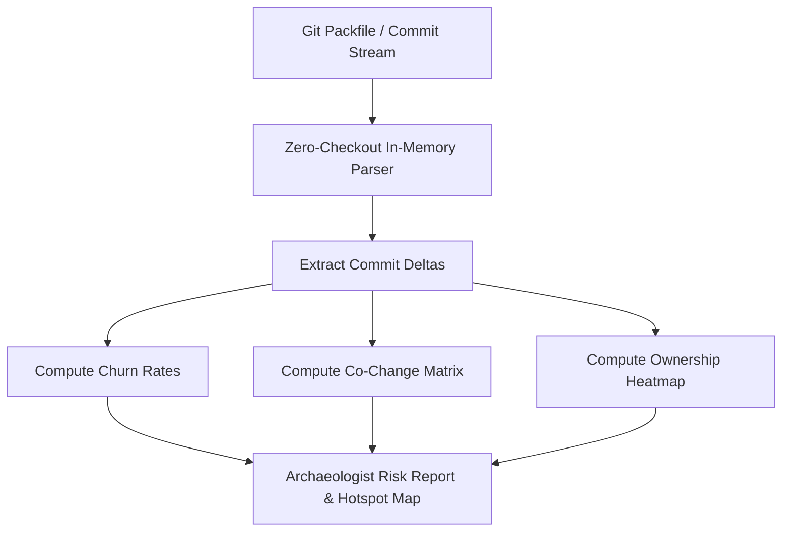

# 🏺 Archaeologist

**Git History, Churn & Hotspot Analyzer.** Archaeologist mines Git VCS history to discover architectural hotspots, co-change temporal coupling, and developer ownership without checking out raw files to disk.

## 🎯 Golden Rules
1. **Zero-checkout streaming**: Parse Git packfiles (`.pack`/`.idx`) directly in memory via `libgit2` / `go-git` to avoid disk I/O bottlenecks.
2. **Identify Temporal Coupling ($P(A \cap B)$)**: Flag files that frequently change together in the same commits across separate directories.
3. **Hotspot Matrix ($Complexity \times Churn$)**: Highlight files with high cyclomatic/indentation complexity combined with high commit revision frequency.
4. **Code Survival Curves**: Track code churn over time to detect fragile areas prone to regressions.

## 🏗️ Architecture & Pipeline



## 🚀 Usage Guide

### 1. Run Hotspot & Churn Audit
```bash
node C:/Users/GdC/.gemini/config/skills/archaeologist/lib/archaeologist.js --repo "." --months 6
```

### 2. Output
Generates `archaeologist-report.md` containing:
* Top 10 Technical Debt Hotspots
* Temporal Coupling Matrix (Implicit Dependencies)
* Ownership & Code Churn Heatmap
